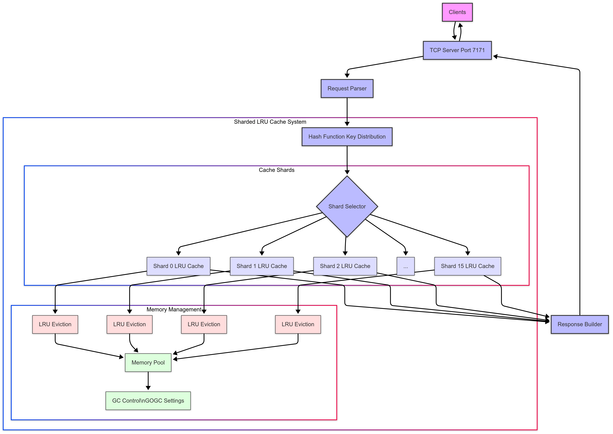
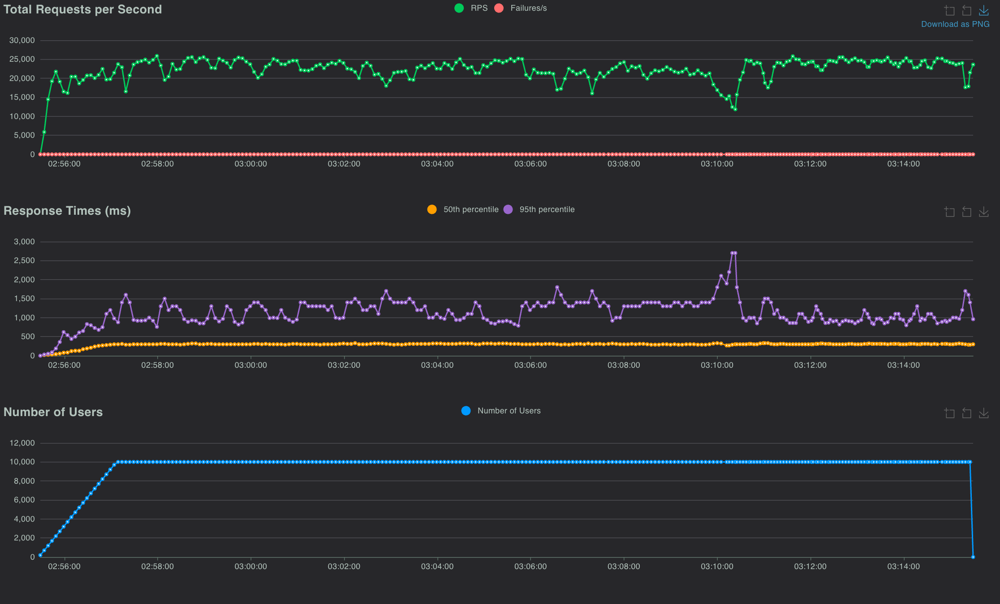

# Key-Value Cache Server

An in-memory key-value cache server implemented in Go, optimized for high throughput and low latency.



## Features

- Sharded LRU cache architecture for concurrent access
- Simple text-based protocol with newline-terminated commands
- TCP connection optimization
- Memory-efficient design with configurable limits
- Zero allocation optimization for hot paths
- Lock-free reads where possible

## Performance Optimizations

### Cache Design

- **Sharding**: Uses 16 independent LRU caches to reduce lock contention
- **Fine-grained Locking**: Separate read/write locks per shard for maximum concurrency

### Memory Management

- **Controlled GC**: Custom GOGC settings to balance throughput and memory
- **Buffer Pooling**: Reuses buffers to reduce GC pressure
- **Zero Allocation**: Critical paths optimized to minimize allocations

## Getting Started

### Prerequisites

- Docker
- Go (for local builds)
- Locust (for load testing)

### Run from Docker Hub

```bash
docker pull bugfinderr/server
docker run --cpus="2" --memory="2g" -p 7171:7171 bugfinderr/server
```

### Build Locally

```bash
git clone https://github.com/Bug-Finderr/hld-key-value-cache.git
cd hld-key-value-cache
go build -o server
./server
```

## Load Testing with Locust

### Setup Environment

```bash
# Create a virtual environment
python3 -m venv venv

# Activate the virtual environment
# On Windows
venv\Scripts\activate
# On Unix/macOS
source venv/bin/activate

# Install Locust
pip install locust
```

### Run Load Test

1. Execute the Locust command:

   ```bash
   locust --host tcp://192.168.1.6:7171 --users 10000 --spawn-rate 100 --run-time 30m
   ```

2. Open the Locust web interface at http://localhost:8089

3. In the web UI, confirm the test settings and click `Start` to begin the test

4. Monitor real-time metrics in the Locust dashboard

## Load Testing Results

Load test was conducted with the following parameters:

- **Number of Users:** 10,000 concurrent users
- **Spawn Rate:** 100 users per second
- **Run Time:** 30 minutes

The server demonstrated appreciable performance under such load. The full test results are available in the [performance report](./assets/report.html).

<br />



## Protocol

The server uses a simple text-based protocol with newline-terminated commands:

### Commands

```shell
PUT <key> <value>    # Store a value
GET <key>            # Retrieve a value
```

Each command should be terminated with a newline character. The server responds with "OK" for successful operations or appropriate error messages.

## Monitoring

```bash
# Monitor TCP connections
netstat -an | grep 7171

# Monitor resource usage
top -p $(pgrep server)
```

For containerized deployments, use Docker's built-in monitoring:

```bash
docker stats $(docker ps -q --filter ancestor=bugfinderr/server)
```

## License

[MIT License](LICENSE)

<br />

> _This README was generated with the help of Copilot_
